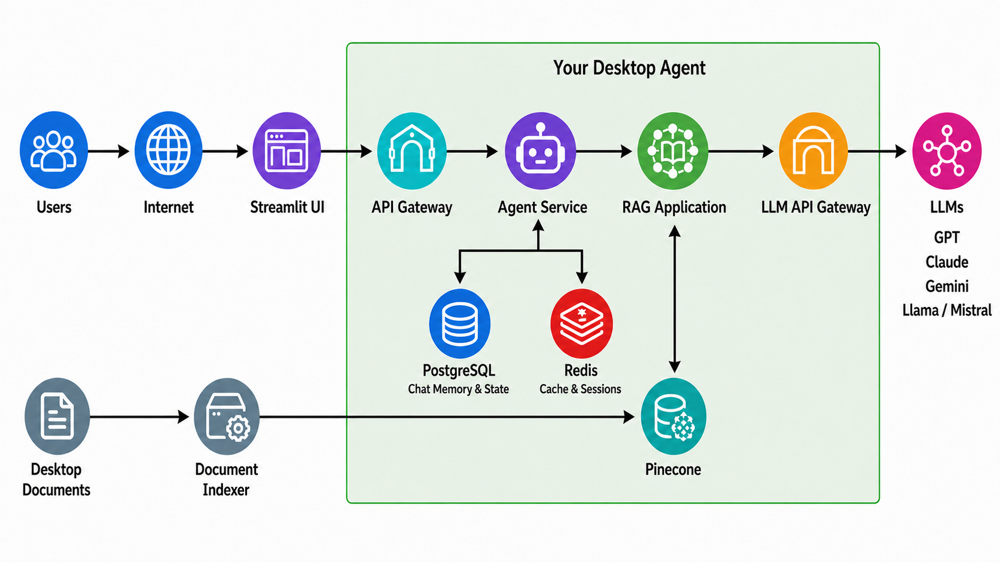

# Architecture

FileSense separates the user interface, API, ingestion pipeline, agent workflow, model gateway, storage, and observability systems. This keeps provider credentials out of the browser and allows the Streamlit interface to be replaced later without rewriting the RAG system.

## Service topology



The primary request path is:

```text
User -> Streamlit UI -> API Gateway -> FastAPI Agent Service
     -> RAG Application -> LLM API Gateway -> selected LLM
```

Document ingestion follows an independent path:

```text
Desktop documents -> Document indexer -> Pinecone
```

Only the Streamlit port should be exposed for normal local use. FastAPI, the gateway, databases, and telemetry services will communicate over private Docker networks. Grafana may be exposed on a localhost-only administrative port.

The inbound API gateway is separate from the LLM API gateway. The inbound gateway protects and routes application traffic to FastAPI. The LLM gateway applies model routing, security, limits, fallback, and observability to outbound model requests.

## Ingestion flow

1. The indexer scans the mounted folder at startup and on a configurable schedule.
2. It compares SHA-256 file manifests with the last completed scan.
3. Supported new or changed files are parsed and normalized.
4. A token-aware recursive splitter creates metadata-rich overlapping chunks.
5. The embedding request passes through the LLM gateway.
6. Embeddings and metadata are batch-upserted into the correct Pinecone namespace.
7. Vectors belonging to removed or replaced files are deleted safely.
8. File and job status is persisted locally and displayed in Streamlit.

Planned defaults are approximately 800 tokens per chunk and 120 tokens of overlap. These values will be configurable and validated.

## Chat flow

The LangGraph state will carry the conversation identifier, messages, standalone query, retrieved chunks, relevance result, answer, citations, model selection, and error information.

The graph will:

1. Validate the question and selected model.
2. Rewrite context-dependent follow-up questions.
3. Retrieve candidate chunks from Pinecone.
4. apply maximal marginal relevance to improve source diversity.
5. Grade whether the evidence is relevant.
6. Generate an answer constrained to that evidence.
7. Assemble verified citation metadata.
8. Stream progress, answer tokens, citations, and completion events.
9. Take an explicit abstention path when the evidence is insufficient.

Document content will be treated as untrusted data, not executable model instructions.

## Memory and caching

The application uses three stores with separate responsibilities:

- **PostgreSQL provides durable application memory.** It stores conversations and messages, LangGraph checkpoints, user settings, selected models, file manifests, indexing jobs, feedback, and audit metadata. A conversation can therefore resume after a process or Docker restart.
- **Redis provides temporary, expiring state.** It stores active sessions, retrieval cache entries, rate-limit counters, streaming coordination, and distributed indexing locks. Redis is an optimization and coordination layer, never the authoritative copy of a conversation.
- **Pinecone provides document knowledge memory.** It stores document embeddings and chunk metadata for semantic retrieval. It does not store ordinary chat history.

Retrieval cache keys will include the normalized query, Pinecone namespace, embedding model, retrieval configuration, and index version. Entries will have a short configurable time-to-live and will be invalidated whenever document synchronization changes the index. Full prompts, retrieved chunks, and generated answers will not be cached by default because they can contain sensitive data.

If Redis is unavailable, chat and retrieval will continue by reading from PostgreSQL and Pinecone, with reduced performance. Features that require coordination, such as distributed job locking or rate limiting, will fail safely rather than silently bypassing their controls.

## Enterprise multi-LLM gateway

The gateway will expose a normalized API while supporting multiple configured providers and model aliases. It will provide:

- User-selected exact-model routing
- Automatic, cost-aware, and latency-aware routing policies
- Ordered fallback with an option to disable silent fallback
- Provider health checks, timeouts, retries, cooldowns, and circuit breakers
- Model allowlists, budgets, rate limits, concurrency controls, and token limits
- Input and output security policies
- Sanitized audit events, metrics, logs, and distributed traces
- Stable routes for chat, query rewriting, relevance grading, and embeddings

Chat models can change without rebuilding the document index. An embedding-model change requires a compatible Pinecone namespace and controlled re-indexing.

## Data ownership

| Data | Planned location |
|---|---|
| Original files | User's local folder |
| File access | Read-only indexer mount |
| Embeddings and chunk metadata | Pinecone |
| Conversations, LangGraph checkpoints, manifests, jobs, and settings | PostgreSQL |
| Sessions, retrieval cache, rate limits, and job locks | Redis with expiration |
| Gateway usage and audit metadata | PostgreSQL, isolated from application records |
| Sanitized telemetry | Local observability services |
| Provider credentials | Runtime secrets, never the browser |
